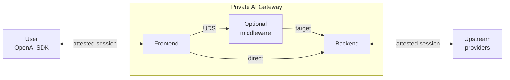

# Private AI Gateway

Private AI Gateway is an OpenAI-compatible gateway for **Attested Confidential
Inference (ACI)**. It publishes dstack workload attestation for the gateway,
verifies configured private-inference upstreams before forwarding prompts, and
signs per-request receipts.

A relying party evaluates three artifacts before accepting a response: the
gateway attestation report, the provider verification event for the selected
route, and the signed receipt that binds the response to the gateway identity.

This repository is a developer preview for the ACI draft in
[`Dstack-TEE/dstack#694`](https://github.com/Dstack-TEE/dstack/pull/694). It is
also the workload that
[`git-launcher`](https://github.com/Dstack-TEE/dstack-examples/tree/main/git-launcher)
can fetch, build, and run inside a dstack v2 application VM.

## Audience

- Security auditors should start with the claim, limits, request flow, and
  auditor checklist.
- New users and agent developers should start with the short mental model and
  local smoke path before reading provider-specific details.

## Security Claim

When the gateway is correctly deployed in dstack with reviewed code, reviewed
runtime config, and supported provider adapters, a relying party can verify
these facts:

1. **Gateway identity**: the gateway is a specific workload running in a genuine
   TEE, with reported source provenance and a stable workload keyset.
2. **Client channel binding**: the user-facing TLS SPKI, when configured, or
   E2EE public keys are published in the attested keyset, so a client can bind
   an API session to the verified workload identity.
3. **Upstream verification**: before a prompt is forwarded, the backend verifies
   the selected upstream provider and gets an enforceable channel binding, such
   as a TLS SPKI or provider E2EE key.
4. **Fail-closed forwarding**: if verification is required and the gateway
   cannot verify the upstream or enforce the verified binding, it does not send
   the prompt.
5. **Per-request evidence**: every provider-backed inference response carries
   `x-receipt-id`. The signed receipt records the user-visible request hash, the
   selected provider route, upstream verification, provider-facing request hash,
   response hash, and any request or response modification events.

### Limits

- It does not make an arbitrary upstream provider private. A provider is only
  acceptable when its adapter can verify a provider-specific identity and
  enforce the request channel binding.
- It does not hide plaintext from gateway middleware. Middleware is optional,
  but if enabled it sees plaintext after downstream E2EE termination and must be
  part of the same attested deployment and audit boundary.
- It does not provide durable public transparency yet. Receipts are currently
  kept in memory with a configurable TTL; public transparency log integration is
  not implemented.
- It does not make a local developer run equivalent to an attested production
  deployment. The production claim depends on dstack attestation, dstack KMS,
  pinned source provenance, and reviewed runtime policy.

## How A Request Is Protected



1. The user verifies `GET /v1/attestation/report` and accepts the gateway
   workload identity and keyset.
2. The user sends an OpenAI-compatible request over ordinary TLS or ACI E2EE.
3. The frontend records the user-facing request and downstream E2EE state.
4. Optional middleware may handle auth, billing, routing, cache-aware logic, or
   rewrites. Middleware does not create verification facts.
5. The backend validates the target route, verifies or refreshes the upstream
   lease, enforces the verified channel binding, and forwards the provider
   request.
6. The response returns through the same path. The frontend signs the receipt
   after it has observed the final user-visible response.

## Auditor Checklist

Use this checklist before treating a deployment as private inference.

| Check | Evidence |
| --- | --- |
| Gateway identity is real | `GET /v1/attestation/report?nonce=<fresh nonce>` proves the TEE quote, workload id, and keyset. The report also carries source provenance that must match the reviewed deployment. |
| Keys are bound to the workload | The keyset in the report lists identity, receipt-signing, E2EE, and optional TLS SPKI keys endorsed by the workload identity. |
| Client session is bound | For direct TLS, verify the server certificate SPKI matches the attested keyset. For ACI E2EE, verify the E2EE public key from the keyset. |
| Upstream is verified | Receipt event `upstream.verified` must be `verified` for the provider and canonical model id. |
| Channel binding is enforceable | The upstream verification event must include a binding the backend can enforce on the actual request path. |
| Upstream session is auditable | `upstream.verified.session_id`, when present, points to `GET /v1/audit/sessions/{session_id}`. The id is derived from the target, verifier, evidence digest, provider claims, and binding material. |
| Middleware is in boundary | If middleware is enabled, audit its source/config and confirm it runs inside the same attested deployment. |
| Response is bound | Verify the receipt signature under the attested receipt key and compare the response hash in `response.returned`. |
| Provider is admissible | Review the provider-specific report in `docs/reviews/providers/` against `docs/reviews/providers/audit-criteria.md`. |

Provider verification and transport binding are backend responsibilities.
Middleware and user-controlled headers can select routes, but they do not create
verification facts.

## What New Users Should Know

You can talk to the gateway with normal OpenAI-compatible clients. The
additional ACI artifacts are:

- `GET /v1/attestation/report`: proves which gateway workload you are talking
  to.
- `x-receipt-id`: returned on provider-backed inference responses.
- `GET /v1/receipt/{id}`: fetches the signed receipt by chat id or receipt id.
- `GET /v1/audit/sessions/{session_id}`: fetches an attested-session audit
  record referenced by a receipt.
- Optional ACI E2EE headers: encrypt selected request/response fields when the
  client wants application-level encryption in addition to TLS.

Useful terms:

- **TEE**: trusted execution environment. In this project, the gateway relies on
  dstack/TDX evidence to prove where the workload is running.
- **E2EE**: end-to-end field encryption between a client and the verified
  gateway workload, used when TLS alone is not enough for the client.
- **Workload identity**: the gateway identity proven by attestation and used to
  endorse receipt-signing and E2EE keys.
- **dstack KMS**: the dstack key-release service used by this implementation to
  obtain stable workload keys inside an approved TEE workload.
- **TDX quote / DCAP**: Intel TDX attestation evidence and the verification
  path used for dstack and ACI/DCAP upstream reports.
- **Receipt**: a signed per-request event log that binds the observed request,
  provider route, upstream verification result, and returned response.
- **SPKI digest**: a SHA-256 digest of a TLS public key used as channel-binding
  evidence when a verifier or attested keyset supplies it.

## Evidence Encoding

ACI evidence objects are byte-preserving:

```json
{
  "digest": "sha256:<sha256-of-decoded-data-bytes>",
  "data": "data:<content-type>;base64,<exact-bytes>"
}
```

The gateway computes `digest` over the bytes obtained by decoding the data URI,
not over a parsed JSON value. When a verifier needs to preserve multiple
upstream responses, `data` may be a `multipart/mixed` data URI whose parts carry
their original content type, source URL, and body bytes.

Do not infer provider semantics from the generic evidence wrapper. Provider
meaning belongs to the provider verifier and the provider review document. The
gateway enforces only the generic verifier result and channel binding.

## Project Status

`0.1.0` is a developer preview. The request path is implemented, but production
release still depends on provider strict-release review, durable operational
storage decisions, and production compose wiring for a concrete middleware
container.

| Area | Status |
| --- | --- |
| Workload identity, keyset digest, attestation report | Implemented |
| Signed receipts and transparency event log | Implemented |
| Chat/completions, streaming, embeddings, `/v1/models` | Implemented; embeddings are buffered |
| Downstream ACI E2EE and legacy vLLM E2EE | Implemented for chat/completions/embeddings; streaming E2EE for chat/completions |
| Runtime upstream config file and admin API | Implemented |
| Gateway-owned Prometheus metrics | Implemented |
| Provider adapters | Implemented for Tinfoil, NEAR AI, Chutes, ACI/DCAP, and generic OpenAI-compatible upstreams |
| Attested-session audit records | Implemented for upstream sessions; downstream sessions pending TLS/domain work |
| Middleware framework | Implemented over HTTP on Unix domain sockets |
| Receipt/body store | In-memory; receipt TTL is configurable, body retention defaults to disabled |
| Public transparency log | Not implemented |

The binary has no ephemeral-key or stub-quote startup mode. It loads identity,
receipt-signing, and E2EE keys from dstack KMS through the Rust `dstack-sdk`,
and it uses the same SDK for TDX quotes.

## Quick Start For New Users

This repository expects a dstack SDK endpoint. By default the gateway uses
`/var/run/dstack.sock`. For local development, point
`PRIVATE_AI_GATEWAY_DSTACK_ENDPOINT` at a forwarded dstack socket.

Prerequisites:

- Rust stable toolchain.
- A reachable dstack SDK endpoint.
- `docker compose`, `curl`, `jq`, `cargo`, `sha256sum`, and `awk` for the local
  multi-upstream smoke test.

Run checks:

```bash
cargo test
cargo fmt --all -- --check
cargo clippy --all-targets -- -D warnings
```

Start an identity-only gateway:

```bash
printf '[]\n' >/tmp/private-ai-gateway-upstreams.json

PRIVATE_AI_GATEWAY_DSTACK_ENDPOINT=unix:/tmp/aci-dstack-sock-dev.dstack.sock \
PRIVATE_AI_GATEWAY_REPO_URL=https://github.com/Dstack-TEE/private-ai-gateway.git \
PRIVATE_AI_GATEWAY_REPO_COMMIT="$(git rev-parse HEAD)" \
PRIVATE_AI_GATEWAY_UPSTREAM_CONFIG_PATH=/tmp/private-ai-gateway-upstreams.json \
cargo run --release --bin private-ai-gateway
```

This starts the gateway and proves the identity surface, but it intentionally
does not configure inference routes.

In another terminal:

```bash
curl -sS http://127.0.0.1:8086/
curl -sS 'http://127.0.0.1:8086/v1/attestation/report?nonce=test'
```

To exercise actual inference behavior without provider API keys, run the local
multi-upstream smoke test:

```bash
DSTACK_SOCK=/tmp/aci-dstack-sock-dev.dstack.sock \
scripts/local_multi_upstream_smoke.sh
```

The smoke test runs two mocked upstream ACI services plus one gateway, all using
the forwarded dstack socket. It asserts model routing, receipts, upstream
verification events, and metrics.

## Verify A Response

A relying party verifies the gateway identity first, then verifies that a
receipt was signed by a key endorsed by that identity.

1. Fetch `GET /v1/attestation/report?nonce=<fresh nonce>`.
2. Send the inference request and save the response body plus the
   `x-receipt-id` response header.
3. Fetch `GET /v1/receipt/{id}` with that receipt id.
4. Verify the attestation report, keyset, receipt signature, response hash, and
   `upstream.verified` event.

Use the helper script when the gateway is reachable:

```bash
uv run python scripts/live_e2e/user_verify.py \
  --base-url http://127.0.0.1:8086 \
  --chat-id "$RECEIPT_ID" \
  --nonce "$NONCE"
```

The script's `--chat-id` argument accepts either a chat id or a receipt id. To
verify already captured artifacts, run the Rust verifier directly:

```bash
cargo run --quiet --example verify_aci_artifacts -- \
  --report report.json \
  --receipt receipt.json \
  --nonce "$NONCE"
```

## Configure Upstreams

The gateway has one mutable upstream config file. Set
`PRIVATE_AI_GATEWAY_UPSTREAM_CONFIG_PATH`; if unset, the default is
`/var/lib/private-ai-gateway/upstreams.json`.

A missing, empty, or whitespace-only file is valid and means no upstreams are
configured yet. Inference routes require a JSON array with at least one
upstream:

```json
[
  {
    "name": "tinfoil-glm51",
    "provider": "tinfoil",
    "base_url": "https://inference.tinfoil.sh",
    "models": {
      "glm51-tinfoil": "glm-5-1"
    },
    "bearer_token": "<tinfoil-api-key>"
  }
]
```

`models` maps public model ids to provider-facing upstream model ids. In
no-middleware mode, the public model id is also the target route id. In
middleware mode, middleware selects a backend target route of this form:

```text
<upstream name>:<public model id in upstream config>
```

Supported `provider` values:

| Provider | Use |
| --- | --- |
| `openai-compatible` | Generic OpenAI-compatible upstream. Verification is controlled by `PRIVATE_AI_GATEWAY_UPSTREAM_VERIFIER`; the upstream config does not currently accept static TLS pin fields. |
| `aci-dcap` | Upstream ACI service that exposes ACI attestation and dstack/DCAP evidence. |
| `tinfoil` | Tinfoil provider adapter using provider-owned verification through `private-ai-verifier`. |
| `near-ai` | NEAR AI gateway adapter with TLS binding from the provider report. |
| `chutes` | Chutes adapter with provider E2EE key verification and encrypted `/e2e/invoke` transport. |

ACI/DCAP verification policy can be set globally with
`PRIVATE_AI_GATEWAY_UPSTREAM_ACCEPTED_WORKLOAD_IDS`,
`PRIVATE_AI_GATEWAY_UPSTREAM_ACCEPTED_IMAGE_DIGESTS`,
`PRIVATE_AI_GATEWAY_UPSTREAM_DSTACK_KMS_ROOT_PUBLIC_KEYS`, and
`PRIVATE_AI_GATEWAY_UPSTREAM_PCCS_URL`, or per upstream with
`accepted_workload_ids`, `accepted_image_digests`,
`accepted_dstack_kms_root_public_keys`, and `pccs_url`.

Tinfoil, NEAR AI, and Chutes use the provider verifier bridge in
`scripts/private_ai_provider_verifier.py`. Install `uv` and set
`PRIVATE_AI_VERIFIER_DIR` to a `private-ai-verifier` checkout, or keep that
checkout as a sibling directory of this repo.

For one-command Compose deployments, set
`PRIVATE_AI_GATEWAY_UPSTREAM_CONFIG_SEED_PATH` to a read-only seed file. The
gateway copies the seed only when the mutable config path is missing or empty.
An existing admin-updated config is never overwritten.

When `PRIVATE_AI_GATEWAY_ADMIN_TOKEN` is set, operators can inspect and replace
the live config:

```bash
curl -H "Authorization: Bearer $PRIVATE_AI_GATEWAY_ADMIN_TOKEN" \
  http://127.0.0.1:8086/v1/admin/upstreams

curl -X PUT \
  -H "Authorization: Bearer $PRIVATE_AI_GATEWAY_ADMIN_TOKEN" \
  -H "content-type: application/json" \
  --data-binary @upstreams.json \
  http://127.0.0.1:8086/v1/admin/upstreams
```

The admin view redacts bearer tokens and returns the active `config_digest`.
If no admin token is configured, the admin endpoint returns `404`.

## Deploy With Git Launcher

The recommended dstack deployment path uses `git-launcher`:

1. `git-launcher` clones this repo at a pinned commit.
2. It runs this repo's `entrypoint.sh`.
3. `entrypoint.sh` builds `private-ai-gateway` with `cargo build --release
   --locked --bin private-ai-gateway`.
4. The built binary runs with runtime config from Compose environment, mounted
   files, dstack encrypted secrets, and dstack KMS.

The launcher stays generic. Build, install, and run logic belongs to this repo.
For production, prefer a Rust-capable gateway image so the toolchain is covered
by a gateway-owned image digest instead of installing Rust at boot.

Deployment files:

- [deploy/README.md](deploy/README.md)
- [deploy/compose.yaml](deploy/compose.yaml)
- [deploy/upstreams.example.json](deploy/upstreams.example.json)
- [entrypoint.sh](entrypoint.sh)

## Middleware

Middleware mode is enabled by a middleware Unix socket path. The gateway also
starts an internal backend socket for middleware to call:

```bash
PRIVATE_AI_GATEWAY_MIDDLEWARE_UDS_PATH=/run/private-ai-gateway/middleware.sock
PRIVATE_AI_GATEWAY_BACKEND_UDS_PATH=/run/private-ai-gateway/backend.sock
```

In middleware mode:

- Public `/v1/models` is forwarded to middleware.
- Public inference requests are decrypted and normalized by the frontend, then
  forwarded to middleware as plaintext HTTP over UDS.
- User headers, including `Authorization`, are forwarded to middleware for
  middleware-owned auth and routing. Gateway-owned and stale E2EE protocol
  headers are stripped.
- Middleware calls `POST /internal/forward` with a one-use request id and a
  configured target route.
- Streaming responses stay streaming across backend, middleware, and frontend.
- Middleware-generated OpenAI-compatible responses are passed through downstream
  E2EE when the original user request used E2EE.

Read [docs/middleware-integration.md](docs/middleware-integration.md) before
writing middleware.

## API Surface

| Endpoint | Purpose |
| --- | --- |
| `GET /` | Basic ACI version, workload id, and keyset digest. |
| `GET /v1/models` | OpenAI-compatible model list from backend or middleware. |
| `POST /v1/chat/completions` | OpenAI-compatible chat completions. |
| `POST /v1/completions` | OpenAI-compatible legacy completions. |
| `POST /v1/embeddings` | OpenAI-compatible buffered embeddings. |
| `GET /v1/attestation/report?nonce=<n>` | Gateway workload identity and keyset evidence. |
| `GET /v1/receipt/{id}` | Signed ACI receipt by chat id or receipt id. |
| `GET /v1/signature/{id}` | Legacy alias of the receipt endpoint. |
| `GET /v1/receipt/{id}/body` | Retained provider-facing request body when retention is enabled. |
| `GET /v1/audit/sessions/{session_id}` | Attested-session audit record referenced by a receipt. |
| `GET /v1/metrics` | Gateway-owned Prometheus metrics. |
| `GET /v1/admin/upstreams` | Authenticated upstream config snapshot. |
| `PUT /v1/admin/upstreams` | Authenticated upstream config replacement. |

## Runtime Configuration

Use `PRIVATE_AI_GATEWAY_*` variables. Older `DSTACK_LLM_ROUTER_*` aliases are
still accepted for compatibility; the `PRIVATE_AI_GATEWAY_*` value wins when
both are set.

| Setting | Variable | Default |
| --- | --- | --- |
| Public bind address | `PRIVATE_AI_GATEWAY_BIND` | `127.0.0.1:8086` |
| Upstream config path | `PRIVATE_AI_GATEWAY_UPSTREAM_CONFIG_PATH` | `/var/lib/private-ai-gateway/upstreams.json` |
| Initial upstream config seed | `PRIVATE_AI_GATEWAY_UPSTREAM_CONFIG_SEED_PATH` | unset |
| Admin bearer token | `PRIVATE_AI_GATEWAY_ADMIN_TOKEN` | unset; admin API returns `404` |
| Source-provenance repo URL | `PRIVATE_AI_GATEWAY_REPO_URL` | required |
| Source-provenance commit | `PRIVATE_AI_GATEWAY_REPO_COMMIT` | required |
| Body retention seconds | `PRIVATE_AI_GATEWAY_BODY_RETENTION_SECONDS` | `0` |
| Receipt TTL seconds | `PRIVATE_AI_GATEWAY_RECEIPT_TTL_SECONDS` | `3600` |
| TLS certificate paths | `PRIVATE_AI_GATEWAY_TLS_CERT_PATHS` | unset |
| TLS SPKI SHA-256 list | `PRIVATE_AI_GATEWAY_TLS_SPKI_SHA256` | unset |
| Domain TLS certificate map | `PRIVATE_AI_GATEWAY_TLS_DOMAIN_CERT_PATHS` | unset |
| Domain TLS SPKI SHA-256 map | `PRIVATE_AI_GATEWAY_TLS_DOMAIN_SPKI_SHA256` | unset |
| Upstream verifier mode | `PRIVATE_AI_GATEWAY_UPSTREAM_VERIFIER` | `none` |
| Accepted upstream workload IDs | `PRIVATE_AI_GATEWAY_UPSTREAM_ACCEPTED_WORKLOAD_IDS` | unset |
| Accepted upstream image digests | `PRIVATE_AI_GATEWAY_UPSTREAM_ACCEPTED_IMAGE_DIGESTS` | unset |
| Accepted upstream dstack KMS root public keys | `PRIVATE_AI_GATEWAY_UPSTREAM_DSTACK_KMS_ROOT_PUBLIC_KEYS` | unset |
| Upstream verifier PCCS URL | `PRIVATE_AI_GATEWAY_UPSTREAM_PCCS_URL` | default verifier PCCS |
| Upstream verifier cache seconds | `PRIVATE_AI_GATEWAY_UPSTREAM_VERIFIER_CACHE_SECONDS` | `300` |
| Upstream connect timeout seconds | `PRIVATE_AI_GATEWAY_UPSTREAM_CONNECT_TIMEOUT_SECONDS` | `10` |
| Upstream read idle timeout seconds | `PRIVATE_AI_GATEWAY_UPSTREAM_READ_TIMEOUT_SECONDS` | `600` |
| Upstream verifier request timeout seconds | `PRIVATE_AI_GATEWAY_UPSTREAM_VERIFIER_REQUEST_TIMEOUT_SECONDS` | `60` |
| dstack SDK endpoint | `PRIVATE_AI_GATEWAY_DSTACK_ENDPOINT` | dstack SDK default socket |
| Middleware UDS path | `PRIVATE_AI_GATEWAY_MIDDLEWARE_UDS_PATH` | unset; middleware disabled |
| Internal backend UDS path | `PRIVATE_AI_GATEWAY_BACKEND_UDS_PATH` | `/run/private-ai-gateway/backend.sock` |

Prefer certificate-path variables for client-facing TLS binding. The gateway
reads each mounted leaf certificate, computes `sha256(SPKI)`, and publishes
that digest in the attested keyset. Use SPKI variables only for manual or test
deployments.

Use `PRIVATE_AI_GATEWAY_TLS_DOMAIN_CERT_PATHS` when the gateway serves multiple
custom domains:

```bash
PRIVATE_AI_GATEWAY_TLS_DOMAIN_CERT_PATHS=api.example.com=/run/certs/api.pem,chat.example.com=/run/certs/chat.pem
```

The equivalent manual form is
`PRIVATE_AI_GATEWAY_TLS_DOMAIN_SPKI_SHA256=api.example.com=<hex>,chat.example.com=<hex>`.
Set only one TLS binding source among the service-wide and domain-mapped
variables. When domain bindings are configured,
`GET /v1/attestation/report` uses the request `Host` to add the matching
`attestation.evidence.downstream_tls_binding` entry while keeping all configured
TLS keys in the attested keyset.

`PRIVATE_AI_GATEWAY_DSTACK_ENDPOINT` accepts HTTP(S) endpoints and Unix socket
endpoints such as `unix:/var/run/dstack.sock`.

## Test And Smoke Suites

Run the standard local checks:

```bash
cargo test
cargo fmt --all -- --check
cargo clippy --all-targets -- -D warnings
```

Run local multi-upstream smoke after changing routing, upstream verification,
receipt hashing, dynamic upstream config, or metrics:

```bash
scripts/local_multi_upstream_smoke.sh
```

Run live upstream smoke after changing provider adapters, attested sessions, or
receipt audit fields:

```bash
uv run python scripts/live_e2e/run.py --profile quick --port 0
```

The live smoke verifies every configured upstream in
`scripts/live_e2e/providers.json`, sends one request per supported surface, then
checks each receipt's `upstream.verified.session_id` against
`GET /v1/audit/sessions/{session_id}`.

Run the slower Phala deployment smoke when you need to validate the deployment
surface:

```bash
scripts/phala_multi_upstream_smoke.sh
```

The Phala smoke deploys two mocked upstream ACI services and one gateway CVM,
then asserts model routing, provider-facing request hashes, verified upstream
events, and metrics model ids.

## Repository Map

```text
src/main.rs                    binary entrypoint and runtime config
src/dstack.rs                  dstack SDK KMS key provider and quote provider
src/aci/                       ACI wire types, canonical JSON, keys, receipts, upstreams
src/aggregator/service.rs      report, forwarding, E2EE, receipt finalization
src/aggregator/upstream_config.rs runtime upstream config and provider adapters
src/http/app.rs                Axum HTTP routers and middleware/backend wiring
docs/                          design notes, provider reviews, middleware guide
deploy/                        git-launcher and dstack compose examples
scripts/                       local and Phala smoke tests
tests/                         unit and integration coverage
```

## More Docs

- [Deployment guide](deploy/README.md)
- [Middleware integration guide](docs/middleware-integration.md)
- [Frontend/middleware/backend architecture](docs/frontend-middleware-backend.md)
- [Live E2E test suite](docs/live-e2e-test-suite.md)
- [Provider audit criteria](docs/reviews/providers/audit-criteria.md)
- [Roadmap](docs/roadmap.md)
