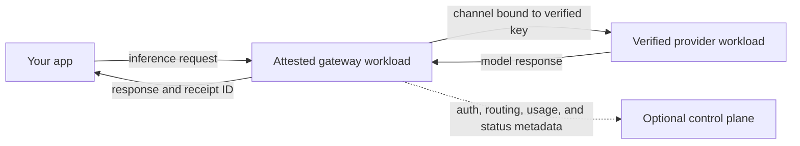

# Private AI Gateway

Private inference you can verify.

Private AI Gateway sits between your app and AI providers. Keep the OpenAI or
Anthropic API shape you already use. The gateway verifies confidential
workloads and binds each network hop to their attested keys before your prompt
leaves the protected path.

This repo contains the Rust reference implementation of
[Attested Confidential Inference (ACI)](spec/aci.md). Use it to test ACI or
build your own gateway and provider integrations. It is a developer preview.

## Try a private inference request

Install the `aci` CLI on Linux or macOS:

```bash
curl --proto '=https' --tlsv1.2 -fsSL \
  https://raw.githubusercontent.com/Dstack-TEE/private-ai-gateway/main/install-aci.sh \
  | sh
```

Then use the Chat Completions API you already know. Replace `YOUR_API_KEY` and
`MODEL_ID` with values from your provider:

```bash
~/.local/bin/aci curl https://api.redpill.ai/v1/chat/completions -- \
  --fail-with-body \
  --no-buffer \
  --header "Authorization: Bearer YOUR_API_KEY" \
  --header "content-type: application/json" \
  --data-binary '{
    "model": "MODEL_ID",
    "messages": [{"role": "user", "content": "Why is this request private?"}],
    "stream": true,
    "provider": {"aci_verified": true}
  }'
```

Before curl sends the body, `aci` verifies a fresh hardware quote, the measured
gateway workload, and the TLS key it reached. It then pins curl to that exact
key. The transcript appears on stderr while the normal API response streams on
stdout. Abridged verification output:

```text
PASS  id-1  hardware quote verifies and binds report_data
PASS  id-4  measured workload provenance connects to public source
PASS  id-6  the TLS channel is bound to the attested keyset
VERIFIED (5 pass, 1 skipped: custody policy not implemented)
PINNED      curl -> attested TLS key
```

The `provider.aci_verified` field handles the next hop. It tells the verified
gateway code to refuse the request unless the selected model backend passes its
own attestation and channel-binding checks. When your policy accepts the
measured gateway and provider workloads, plaintext stays inside those attested
workloads. The model processes it there. Under the TEE threat model, the model
operator and cloud host cannot inspect the protected memory that holds it.

The full transcript reports every skipped policy check. The current CLI does
not yet evaluate private-key custody, and `aci curl` does not verify the
response receipt. Use [`aci send`](docs/quickstart.md#verify-one-inference-end-to-end)
or [`aci serve`](docs/quickstart.md#use-it-as-a-local-endpoint) for receipt
verification, and read the [verification guide](docs/attested-confidential-inference.md)
before sending sensitive data.

This repo contains the implementation and verifier. It does not issue Redpill
API credentials or operate the example service. Continue with the
[ACI quickstart](docs/quickstart.md) for the full verification path, or read the
[ACI specification](spec/aci.md) for the trust model and wire protocol.

## Why this exists

HTTPS protects your connection to a domain. It can't tell you which program is
handling your prompt, whether that program runs in protected hardware, or
whether a gateway sent the prompt to a different backend.

ACI lets you check those details. It connects the gateway's attested keyset, the
provider's attestation, the channel used for forwarding, and the request and
response hashes in one verifiable trail.

The gateway and model still need plaintext to do their jobs. Private inference
makes the workloads that see that plaintext verifiable. The optional E2EE v2
compatibility extension also hides supported inference fields from
infrastructure between your app and the gateway workload.

## Add one field

Your app doesn't need a new SDK. Add `provider.aci_verified` to any supported
request that must use a verified provider:

```json
{
  "model": "public-model-id",
  "messages": [
    {"role": "user", "content": "Explain remote attestation in one sentence."}
  ],
  "provider": {
    "aci_verified": true
  }
}
```

With that flag set:

- verification or channel-binding failure stops the request before the provider
  receives your prompt
- a successful response includes `x-receipt-id`, which points to a signed
  receipt covering the request, response, route, and verification result

The receipt stores hashes, not your prompt or response body. When the provider
returns an enforceable binding, the receipt also links to an immutable session
record with the provider's claims and evidence.

## Where your data goes


```mermaid
flowchart LR
    client[Your app] -->|inference request| gateway[Attested gateway workload]
    gateway -->|channel bound to verified key| provider[Verified provider workload]
    provider -->|model response| gateway
    gateway -->|response and receipt ID| client
    gateway -.->|auth, routing, usage, and status metadata| control[Optional control plane]
```

Two workloads see plaintext: the attested gateway workload and the verified
provider workload that runs the model. The optional E2EE v2 compatibility
extension keeps supported prompt fields encrypted until they reach the gateway
workload. The provider binding stops an ACI-required request from using a
channel that doesn't match the verified provider key.

The optional control plane stays out of the inference-content path. The gateway
doesn't send it prompt or response bodies, raw bearer tokens, or provider
credentials. It gets the bearer-token hash, requested model, routing options,
and the metadata needed for auth, pricing, and usage reporting. The routing
object is forwarded as-is, so don't put prompts or secrets in it. The
[control-plane contract](docs/control-plane-contract.md) lists every field.

## How the proof works

A trusted execution environment (TEE) is a hardware-isolated place to run code.
This gateway uses Intel TDX through dstack. ACI builds a verification chain on
top of it:

1. The gateway publishes a nonce-bound attestation report whose hardware quote
   binds the workload keyset digest. The nonce prevents an old report from
   passing as a fresh one.
2. A provider adapter checks the selected backend's evidence before the prompt
   leaves the gateway.
3. The gateway takes the provider key from that evidence and requires the real
   forwarding channel to use it.
4. After the response, the gateway signs a receipt containing request and
   response hashes, the route, and the verification result.
5. For a deeper audit, the receipt can link to a content-addressed session with
   the full provider evidence.

You still decide what counts as trusted: hardware roots, measurements, workload
source, provider adapters, and claims. The reference `aci` CLI and TypeScript
client verify the quote and report-binding chain; their default policy still
leaves some appraisal decisions, including private-key custody and exact
source-build acceptance, to the relying party. Read the
[verification and security guide](docs/attested-confidential-inference.md)
before sending sensitive data.

> [!IMPORTANT]
> Private inference is opt-in. Configuring a TEE provider does not make every
> request fail closed. Set `provider.aci_verified: true`, pass a non-empty
> `provider.aci_session_ids` allowlist, or use a hostname listed in
> `middleware.tee_only_domains`. Without one of these constraints, the gateway
> may still forward after verification fails and record the failure in the
> receipt.

## Pick a routing mode

The gateway has two routing modes:

- Direct mode maps the public model ID through `upstreams.json` and sends the
  request to one configured upstream.
- Middleware mode asks an external control plane to authorize the request,
  price it, and return an ordered route list. Request handling stays in the
  gateway's Rust process. The control plane receives metadata, not inference
  content or provider credentials.

## API coverage

Current API coverage:

- OpenAI Chat Completions, legacy Completions, Embeddings, and Responses create
- Anthropic Messages
- buffered and SSE responses where the selected surface supports streaming
- the ACI E2EE v2 compatibility extension for Chat Completions, Completions,
  and Embeddings
- canonical attestation, receipt, session, metrics, and admin APIs
- legacy dstack-vllm-proxy attestation and signature aliases

The [HTTP API reference](docs/api-reference.md) lists every route, mode-specific
behavior, authentication rule, and size limit.

## Run it locally

The production binary has no generated-key or fake-quote mode. A local run
still needs a reachable dstack SDK endpoint. If the process is outside a dstack
CVM, first [forward and verify a dev CVM socket](docs/getting-started.md#connect-to-the-dstack-sdk).

### Prerequisites

- Rust stable
- Python 3.12 and [uv](https://docs.astral.sh/uv/)
- a reachable dstack SDK endpoint

The smoke suites need extra tools. See the [testing guide](docs/live-e2e-test-suite.md)
before running them.

### Start the gateway

Install the Python environment used by the provider verifiers:

```bash
uv sync --locked
```

Create a static gateway config:

```bash
mkdir -p /tmp/private-ai-gateway-state

cat >/tmp/private-ai-gateway.config.json <<'JSON'
{
  "bind": "127.0.0.1:8086",
  "state_dir": "/tmp/private-ai-gateway-state",
  "dstack_endpoint": "unix:/tmp/aci-dstack-sock-dev.dstack.sock"
}
JSON
```

Start the service:

```bash
PRIVATE_AI_GATEWAY_CONFIG_PATH=/tmp/private-ai-gateway.config.json \
  cargo run --release --locked --bin private-ai-gateway
```

The gateway starts with no inference routes when
`/tmp/private-ai-gateway-state/upstreams.json` is absent or empty. In another
terminal, confirm the process and fetch a nonce-bound canonical report:

```bash
curl --fail --silent --show-error http://127.0.0.1:8086/health

NONCE="$(openssl rand -hex 32)"
curl --fail --silent --show-error \
  "http://127.0.0.1:8086/v1/aci/attestation?nonce=$NONCE" \
  -o report.json
```

`/health` should return `{"status":"ok"}`. A successful report contains
`api_version: "aci/1"`, a `workload_keyset_digest`, and the plain
`attestation.workload_keyset` object bound by the quote.

For local inference without provider credentials, run the
[multi-upstream smoke test](docs/live-e2e-test-suite.md#run-the-local-multi-upstream-smoke-test).
For a real provider, continue with the
[configuration reference](docs/configuration-reference.md#upstream-configuration).

## Verify the response

Save the response body exactly as received and read `x-receipt-id` from the
headers. Fetch the receipt with the same bearer token you used for inference:

```bash
curl --fail --silent --show-error \
  -H "Authorization: Bearer $API_KEY" \
  "$GATEWAY_URL/v1/aci/receipts/$RECEIPT_ID" \
  -o receipt.json
```

Check the captured files with the `aci` CLI:

```bash
aci audit \
  --report report.json \
  --receipt receipt.json \
  --nonce "$NONCE" \
  --response-body response.json
```

This runs the same quote, binding-chain, receipt, body-hash, and session checks
as the live client. Review skipped checks in the transcript and apply your own
source provenance, key-custody, key-expiry, and provider policy. The
[verification guide](docs/attested-confidential-inference.md) covers the full
flow.

Browser clients can use
[`@phala/aci-verifier`](clients/verifier-ts/README.md) for service, quote,
report-binding, receipt, body-hash, and session verification. Node and Bun apps
can import `connectAci()` from `@phala/aci-verifier/runtime` to get an
instance-scoped, attested SPKI-pinned fetch transport. See the
[client architecture](clients/architecture.md) and
[coding-agent guide](clients/coding-agents.md) for framework integrations.

## Docs

Start at the [documentation index](docs/README.md). The main paths are:

| Goal | Document |
| --- | --- |
| Understand the trust model and verify artifacts | [ACI verification and security model](docs/attested-confidential-inference.md) |
| Run the gateway locally | [Local development](docs/getting-started.md) |
| Configure the gateway, middleware, or an upstream | [Configuration reference](docs/configuration-reference.md) |
| Integrate an HTTP client | [HTTP API reference](docs/api-reference.md) |
| Use the verified TypeScript transport | [ACI client architecture](clients/architecture.md) |
| Use ACI from Pi | [Pi provider extension](clients/pi-provider/README.md) |
| Implement a control plane | [Control-plane contract](docs/control-plane-contract.md) |
| Deploy with dstack git-launcher | [Deployment guide](deploy/README.md) |
| Review provider verification | [Provider index](docs/providers/README.md) |
| Run tests and live provider checks | [Testing guide](docs/live-e2e-test-suite.md) |
| Implement the protocol | [ACI specification](spec/README.md) |
| Contribute a change | [Contributing guide](CONTRIBUTING.md) |

## Security boundaries

Keep these limits in mind before treating a deployment as private:

- A generic OpenAI-compatible route stays a normal TLS route. It becomes
  confidential only when an implemented provider adapter can verify it and bind
  the forwarding channel.
- Requests without an ACI constraint may continue after verification fails.
- The attested gateway workload sees plaintext. The external control plane gets
  routing and usage metadata, but not prompt or response bodies.
- Receipts live in memory for one hour and disappear on restart. They store body
  hashes, not the request or response itself.
- Reported source or image metadata still needs a verifier policy. Reporting a
  value doesn't mean your deployment has approved it.
- A local process using a forwarded dev socket has the remote CVM's identity and
  measurements. It is not equivalent to a reviewed production deployment.

Attested-session records are stored in `<state_dir>/sessions.jsonl` and use the
same one-hour retention window unless the binary configuration changes in code.

## Repository layout

| Path | Contents |
| --- | --- |
| `src/aci/` | ACI wire types, canonicalization, receipts, E2EE, upstream transports, and verifiers |
| `src/bin/aci/` | `aci` verifier, audit, session, curl, send, and local proxy commands |
| `src/aggregator/` | request service, routing state, receipts, sessions, and metrics |
| `src/http/` | Axum routes and HTTP response handling |
| `src/middleware/` | in-process control-plane client, transforms, failover, pricing, and SSE handling |
| `clients/verifier-ts/` | browser verifier plus Node and Bun verified transports |
| `clients/pi-provider/` | Pi provider extension and branded packages |
| `deploy/` | dstack git-launcher deployment example |
| `docs/` | operator guides, references, security notes, and review records |
| `examples/` | Rust verification examples and the sample control plane |
| `scripts/` | provider verifier bridge and smoke suites |
| `spec/` | ACI specification, related work, and test vectors |
| `tests/` | Rust integration tests and provider-verifier tests |

## License

[Apache License 2.0](LICENSE)
