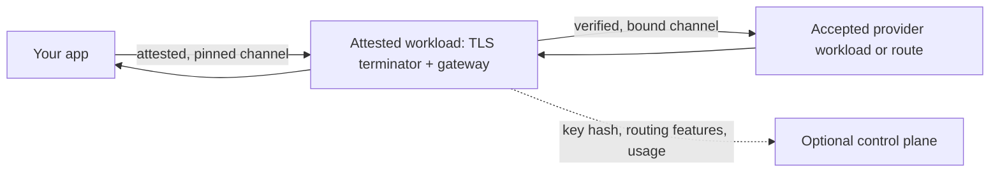

# Private AI Gateway

**Call the LLM APIs you already know. Verify who can read the request before
you send it.**

Private AI Gateway is an OpenAI- and Anthropic-compatible gateway for private
inference. It runs inside a trusted execution environment (TEE), verifies the
confidential provider path selected for the model, and gives the client
evidence it can check independently.

This repository contains the Rust reference implementation of
[Attested Confidential Inference (ACI)](spec/aci.md). It is a developer
preview.

## Try it

Install the Private AI Proxy CLI (macOS, Linux, or Windows):

```bash
npm install --global private-ai-proxy
```

[Other installation options](docs/private-ai-proxy-install.md) include Homebrew,
desktop packages, and native install scripts. You also need system `curl`.

Then call Chat Completions as usual. Replace `YOUR_API_KEY` and `MODEL_ID`
with values from your provider:

```bash
pap curl https://tee.redpill.ai/v1/chat/completions -- \
  --fail-with-body \
  --no-buffer \
  --header "Authorization: Bearer YOUR_API_KEY" \
  --header "content-type: application/json" \
  --data-binary '{
    "model": "MODEL_ID",
    "messages": [{"role": "user", "content": "Why is this request private?"}],
    "stream": true,
    "provider": {"aci_verified": true}
  }'
```

Before curl sends anything, `pap` fetches a fresh attestation report and
verifies it. curl then runs pinned to the TLS key the report declares. The
verification transcript goes to stderr and the API response streams on stdout.
Abridged transcript:

```text
PASS  id-1  hardware quote verifies to TEE vendor root and binds report_data
PASS  id-4  source provenance connects workload to public code — compose-hash=7c1e…40db
SKIP  id-5  private-key custody and subject per policy — no custody policy configured
PASS  id-6  the channel actually used is bound to the attested keyset
VERIFIED (5 pass, 1 skipped: no custody policy configured)
```

The `provider.aci_verified` field covers the second hop. The gateway refuses
the request unless the selected model backend passes its own attestation and
channel-binding checks. See [Make a request fail closed](#make-a-request-fail-closed).

`tee.redpill.ai` is a live deployment operated outside this repository, and
this project does not issue its API keys. The [quickstart](docs/quickstart.md)
walks through inspecting the evidence, pinning a release, and verifying a
response receipt, which `pap curl` does not do.

## What a passing check proves

HTTPS proves that you reached a domain. The checks above prove more:

| Check | What you learn |
| --- | --- |
| Hardware quote with your nonce | The report is fresh and comes from genuine TEE hardware. |
| Measured compose hash | Which compose file the TEE booted. In the [reference deployment](deploy/README.md), that file names the exact gateway commit. |
| Attested keyset | Which receipt, E2EE, and TLS keys the measured workload uses. |
| Channel binding | Your connection uses the TLS key the report declares. |

The checks do not decide whether that compose, and the code it names, is
something you accept. You choose how to settle that:

- **Audit and pin.** Review the compose and the gateway commit, then pass
  `--accept-compose <hash>`. `pap` refuses any other release.
- **Trust the operator.** Skip pinning and rely on the operator, such as Phala,
  to review what it deploys. The transcript still prints the compose hash.
- **Audit afterward.** Record the compose hash from the transcript and review
  that release later.

Key custody works the same way. The gateway derives its receipt and E2EE keys
from dstack KMS inside the TEE. With `--accept-subject` and
`--accept-dstack-kms-root-public-key`, `pap` checks the receipt key's KMS
chain (id-5). The TLS private key has no such chain: it stays inside the TEE
only if the reviewed compose runs the TLS terminator and keeps its key there.
The gateway itself serves plain HTTP behind that terminator.

The [security model](docs/attested-confidential-inference.md) lists what
remains outside these checks, including provider-side limits and the absence
of a transparency log.

## Where your data goes


```mermaid
flowchart LR
    client[Your app] -->|attested, pinned channel| gateway[Attested workload: TLS terminator + gateway]
    gateway -->|verified, bound channel| provider[Accepted provider workload or route]
    provider --> gateway --> client
    gateway -.->|key hash, routing features, usage| control[Optional control plane]
```

The accepted gateway, provider-router, and model workloads see plaintext
because they process it. Under the TEE threat model, their operators and the
cloud host cannot read that plaintext from protected memory. Your local app
also sees the prompt and response.

The optional control plane never receives prompt or response bodies, raw
bearer tokens, or provider credentials. It does receive routing features
derived from the request, including a token estimate and a hash of the first
4 KiB of the conversation. Without `middleware.prefix_hash_secret`, that hash
lets the control plane confirm a prefix it already knows. The
[security model](docs/attested-confidential-inference.md#who-receives-what)
lists every field that leaves the request path.

The optional [E2EE v2 extension](spec/e2ee-v2.md) keeps supported content
fields encrypted between the client and the gateway workload. The gateway and
model still see plaintext.

## Make a request fail closed

Private inference is opt-in per request. Configuring a TEE provider alone does
not make requests fail closed. Use one of:

- `"provider": {"aci_verified": true}` in the request body;
- a non-empty `provider.aci_session_ids` list, which pins the
  [attested sessions](docs/attested-confidential-inference.md#pin-an-upstream-session)
  you accept; or
- a hostname listed in `middleware.tee_only_domains`.

With any of these, a failed verification or channel binding stops the request
before the provider receives the prompt. Without them, the request may
continue and the receipt records the failure.

A successful response carries `x-receipt-id`. It resolves to a signed receipt
that holds hashes of the request and response, not their content.

## Choose a client

| You want to | Use |
| --- | --- |
| Make one API request over a verified, pinned channel | [`pap curl`](apps/desktop/docs/cli.md#aci-commands) |
| Verify one chat response and its receipt end to end | [`pap send`](docs/quickstart.md#5-verify-one-inference-end-to-end) |
| Give any local OpenAI-compatible app a verified endpoint | [`pap serve`](docs/quickstart.md#4-use-it-as-a-local-endpoint) |
| Manage profiles and coding agents with a desktop app | [Private AI Proxy](apps/desktop/README.md) |
| Verify artifacts in a browser, or add pinned fetch to Node or Bun | [`@phala/aci-verifier`](clients/verifier-ts/README.md) |
| Add catalog, lifecycle, receipts, and inspection to a host adapter | [`@phala/aci-provider`](clients/provider/README.md) |
| Use private inference from Pi or OpenCode | [Coding-agent integrations](clients/coding-agents.md) |

Browser JavaScript can verify artifacts but cannot pin a TLS key. Use the CLI,
a Node or Bun transport, or a local verifying proxy when the channel must be
pinned.

## Run your own gateway

Self-hosting needs a dstack SDK endpoint, gateway state, at least one upstream,
and your own policy for authentication, networking, measurements, and provider
credentials.

- [Local development](docs/getting-started.md) runs the gateway against a
  forwarded dstack socket.
- [Configuration reference](docs/configuration-reference.md) defines every
  gateway and upstream field.
- [Deployment guide](deploy/README.md) deploys the gateway with dstack
  git-launcher.
- [Testing guide](docs/live-e2e-test-suite.md) covers local and live-provider
  tests.

The gateway has two routing modes. Direct mode maps a public model ID to a
configured upstream. Middleware mode asks an external control plane for
authorization, pricing, and an ordered route list. Inference handling stays
inside the gateway process in both modes.

## API coverage

The current gateway supports:

- OpenAI Chat Completions, Completions, Embeddings, and Responses create;
- Anthropic Messages;
- buffered and SSE responses where the selected API supports streaming;
- E2EE v2 for Chat Completions, Completions, and Embeddings;
- canonical attestation, receipt, session, metrics, and admin APIs; and
- legacy dstack-vllm-proxy attestation and signature aliases.

See the [HTTP API reference](docs/api-reference.md) for route behavior,
authentication, mode differences, and limits.

## Documentation

Start at the [documentation index](docs/README.md), or jump directly to a
task:

| Goal | Document |
| --- | --- |
| Understand the privacy claim and verify the proof | [Verification and security](docs/attested-confidential-inference.md) |
| Use the CLI against a live service | [ACI quickstart](docs/quickstart.md) |
| Integrate a client or coding agent | [ACI clients](clients/README.md) |
| Run or configure the gateway | [Local development](docs/getting-started.md) and [configuration](docs/configuration-reference.md) |
| Implement a control plane | [Control-plane contract](docs/control-plane-contract.md) |
| Deploy with dstack git-launcher | [Deployment guide](deploy/README.md) |
| Audit provider verification | [Provider verification](docs/providers/README.md) |
| Implement ACI | [Specification index](spec/README.md) |
| Contribute | [Contributing guide](CONTRIBUTING.md) |

## Repository layout

| Path | Contents |
| --- | --- |
| `crates/aci-protocol/` | Shared ACI wire types and deterministic encoding rules |
| `src/aci/` | ACI types, receipts, E2EE, transports, and verifiers |
| `src/http/app/` | HTTP routes, handlers, and error envelopes |
| `apps/desktop/cli/` | `pap` CLI: ACI verification, curl, send, and local proxy |
| `src/aggregator/` | routing, receipt, session, and metrics services |
| `src/middleware/` | control-plane client, transforms, failover, and pricing |
| `clients/` | TypeScript verifier, provider kernel, Pi, and OpenCode adapters |
| `deploy/` | dstack git-launcher deployment example |
| `examples/control-plane/` | Reference control-plane server |
| `docs/` | guides, references, security notes, and review records |
| `scripts/` | provider verifier bridge and smoke suites |
| `spec/` | ACI specification and test vectors |
| `tests/` | Rust integration and provider-verifier tests |

## License

[Apache License 2.0](LICENSE)
