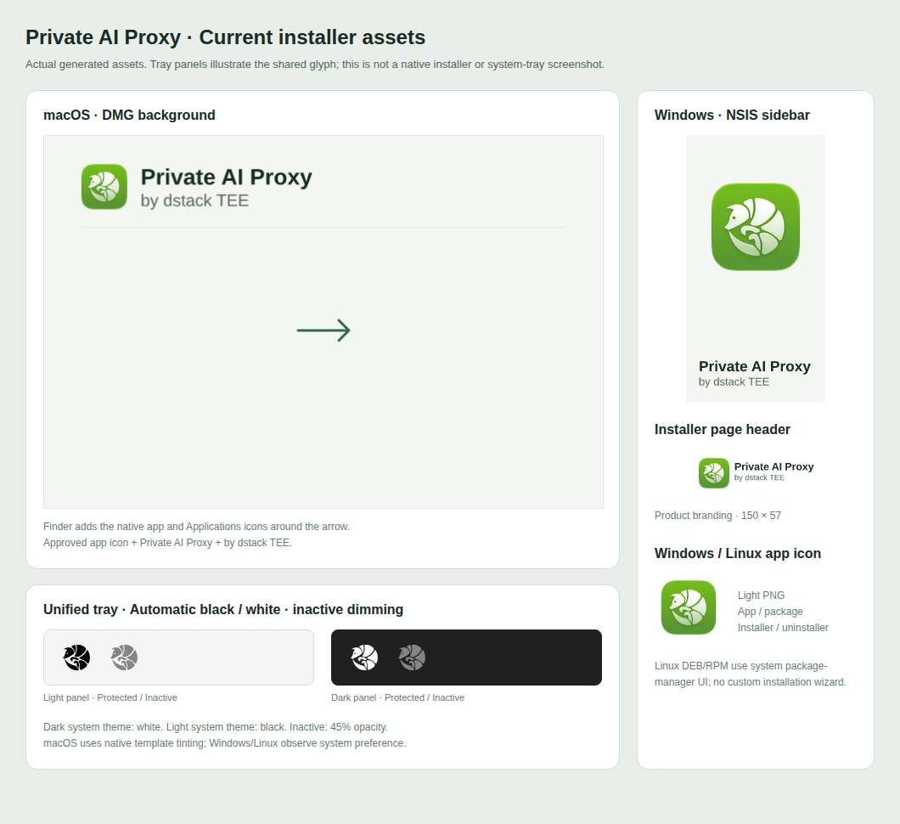
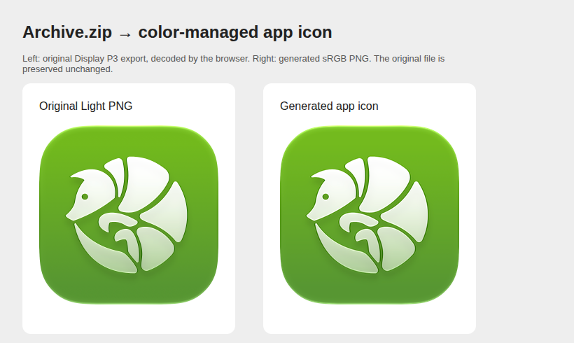

# Final desktop branding previews

Reference screenshots of the approved materials, captured on September 12, 2026.
They match the generated branding assets in commit `3c3adbd` and are documentation
only, not resources bundled into the application.

## Installer materials and tray states

- Use the Light app icon everywhere except macOS dark appearance.
- Product branding: the app icon, **Private AI Proxy**, and **by dstack TEE**.
- Tray: black on light system backgrounds, white on dark backgrounds; inactive
  opacity is 45%. macOS uses native template tinting; Windows/Linux observe
  system appearance preferences.
- DMG: 660 × 440 window, application center (180, 230), Applications center
  (480, 230), and arrow center (330, 230).

This is a material preview, not a native installer or system-tray screenshot.
Finder adds the actual application and Applications folder icons to the DMG.
Linux package installation uses the system package-manager interface.

## Original versus generated color

The left image is the owner's original Display P3 Light export. The right is
its color-managed sRGB version used in generated app assets. The source files
and native Icon Composer project remain unchanged.

When updating branding, regenerate and review these previews alongside the
source assets. Production DMG placement is checked separately by
[`verify-dmg-layout.mjs`](../../../scripts/verify-dmg-layout.mjs) on macOS CI.
