# ACI client product architecture

## Product goal

An ACI client must verify the remote confidential workload before it sends any
model request bytes. Pi is one consumer of that capability, not the product
boundary. The same verified connection must work for SDK applications and for
standalone coding agents without duplicating verification in every framework.

In plain terms, normal HTTPS proves which domain a client reached. ACI adds
proof of which TEE workload is behind that domain, which workload keys it owns,
which compose was measured at launch, and whether the channel actually used is
bound to those keys.

## Architecture and ownership

```mermaid
flowchart LR
  classDef upstream fill:#e8f3ff,stroke:#2878b5,color:#102a43
  classDef pr fill:#fff4d6,stroke:#b7791f,color:#4a2c0a
  classDef refactor fill:#e8f8ee,stroke:#25855a,color:#123c2b
  classDef pending fill:#ffe9e7,stroke:#c4473a,color:#541e18
  classDef external fill:#f3f4f6,stroke:#6b7280,color:#1f2937

  subgraph local[Client machine]
    pi[Pi provider<br/>original PR, refactored]:::pr
    ocadapter[OpenCode provider<br/>new]:::refactor
    core[ACI provider core<br/>new]:::refactor
    sdk[OpenAI, Agents, LangChain,<br/>Vercel AI SDK]:::external
    opencode[OpenCode on Bun]:::external
    agents[Codex and Claude Code]:::external
    connect[connectAci shared runtime client<br/>current refactor]:::refactor
    node[Node fetch adapter<br/>current refactor]:::refactor
    bun[Bun fetch adapter<br/>current refactor]:::refactor
    serve[aci serve local proxy<br/>existing upstream]:::upstream

    pi --> core
    opencode --> ocadapter --> core
    core --> connect
    sdk --> connect
    connect -->|Node host| node
    connect -->|Bun host| bun
    agents --> serve
  end

  subgraph trust[Shared trust contract]
    identity[Quote, nonce, keyset,<br/>compose and expiry<br/>existing verifier checks]:::upstream
    release[Reviewed compose allowlist<br/>TS/Pi: current refactor<br/>Rust flag: existing upstream]:::refactor
    audit[Verified serving, wire digests,<br/>receipt and session policy<br/>current refactor]:::refactor
    channel[Hostname and attested<br/>TLS SPKI binding]:::refactor
    identity --> release --> audit --> channel
  end

  node --> identity
  bun --> identity
  serve --> identity

  subgraph tee[Private AI Gateway inside the TEE - existing upstream]
    api[OpenAI, Responses and<br/>Anthropic API surfaces]:::upstream
    frontend[ACI frontend<br/>attestation and receipts]:::upstream
    routing[Optional control-plane<br/>auth and routing]:::upstream
    backend[Verified provider backend]:::upstream

    api --> frontend --> routing --> backend
  end

  channel -->|verified, SPKI-pinned TLS| api
  backend --> provider[TEE or private model provider]:::external

  pipeline[Redpill and Phala release pipeline<br/>publish reviewed compose hashes<br/>product work still pending]:::pending
  pipeline -. supplies policy .-> release
```

Legend:

- Blue: capability that already existed upstream before the Pi integration.
- Yellow: Pi-specific product surface introduced by the original PR.
- Green: framework-neutral transport and trust-policy work added while the PR
  was refactored.
- Red: work still required to complete the production product.
- Gray: external client or provider software.

The history is more precise than a single color can show for components that
were hardened in place:

| Component or behavior | Origin |
| --- | --- |
| ACI protocol, gateway surfaces, attestation, receipts and sessions | Existing upstream |
| Rust `aci` verifier, `aci serve`, TLS channel binding and `--accept-compose` | Existing upstream |
| TypeScript quote, nonce/keyset, compose and expiry checks | Existing upstream |
| Pi provider, branded packages, model discovery and initial Pi TLS pinning | Original PR |
| Framework-neutral model, lifecycle, policy, status and receipt provider core | Current OpenCode work |
| Native OpenCode v1 plugin and RedPill distribution | Current OpenCode work |
| `connectAci()` framework-neutral, instance-scoped runtime client | Current refactor |
| Node adapter using the supported undici dispatcher hook | Current refactor |
| Bun adapter using the supported `fetch({ tls, proxy })` hooks | Current refactor |
| Quote-before-pin enforcement, no verification downgrade, origin isolation and safe multi-SPKI rotation | Current refactor |
| TypeScript/Pi `acceptedComposeHashes` aligned with Rust policy | Current refactor |
| Streaming wire-digest capture and on-demand receipt/session audit in Node/Pi | Current refactor |
| Compiled ESM npm packages, declaration maps, package lint, clean-install smoke and OIDC release workflow | Current refactor |
| Direct OpenCode integration through its provider `options.fetch` hook | Current refactor |
| Fail-closed OpenCode provider ownership, live model discovery and end-of-stream receipt audit | Current OpenCode work |
| Coding-agent integration guide around the shared transport boundary | Current refactor |
| Reviewed compose publication from Redpill and Phala release pipelines | Pending product work |

`aci serve` is not a new protocol translator and was not introduced by the Pi
integration. It is the existing Rust local verifying proxy. It preserves the
request path and body, so the gateway must implement the protocol spoken by the
agent. `connectAci()` is the new runtime client for applications that accept a
custom `fetch`. Node and Bun expose the same public API and differ only in how
their native `fetch` receives the TLS identity callback.

## One trust contract, two integrations

Fetch-aware Node and Bun applications inject `connectAci().fetch`. Software
that exposes only a base URL points at `aci serve` on localhost. This is a
capability split, not two competing ACI products: one side receives a function,
the other can only receive a URL. Both paths must enforce the same security
meaning:

1. Verify a fresh TDX quote and its nonce-bound workload keyset.
2. Verify that `sha256(app_compose)` is measured into the quote's RTMR3.
3. When an allowlist is configured, require the measured compose hash to be one
   of the reviewed releases.
4. Reject expired identities.
5. Send inference traffic only over hostname-validated TLS whose observed SPKI
   is in the attested keyset.
6. Apply verified-serving and session constraints before forwarding.
7. Retain exact wire digests and verify signed receipts/sessions on demand.
8. Fail closed on any required check.

Implementations may use different languages while sharing policy semantics and
conformance tests. Rust exposes the release policy as repeatable
`--accept-compose` flags. TypeScript exposes it as
`acceptedComposeHashes` and Pi passes the same policy through its brand profile
or deployment configuration.

Within TypeScript, all quote, keyset, policy, rotation, request constraint,
digest, receipt, and session logic is shared. The Node adapter uses undici's
scoped dispatcher; the Bun adapter uses Bun's native TLS and proxy fetch
options. Conditional npm exports select the adapter.

## Hardware proof versus release acceptance

These are deliberately separate claims:

- **Hardware-bound mode:** with no compose allowlist, the client proves that a
  genuine TDX workload owns the attested keys and reports the measured compose.
  It does not claim that the workload release was reviewed.
- **Reviewed-release mode:** an operator or branded distribution supplies
  reviewed compose hashes. A different deployment fails before inference bytes
  are sent.

`source_provenance.repo_url` and `repo_commit` are useful labels, but they are
self-declared by the report. They are not the release trust anchor. The compose
hash is the value bound into RTMR3 and is therefore the value a verifier pins.
Clients obtain accepted compose hashes from authenticated release metadata.

The neutral SDK may intentionally use hardware-bound mode for self-hosted and
development deployments. A production Redpill or Phala branded client should
ship or securely obtain a reviewed compose allowlist and use reviewed-release
mode by default.

## Remaining product work

The transport and npm release mechanics are no longer the main blockers. The
deployment release process must still close the trust loop:

1. Review the gateway source and complete deployment compose.
2. Produce the deterministic compose hash for the approved release.
3. Publish the hash through an authenticated release channel.
4. Ship it in the branded client policy, allowing an explicit overlap window
   during controlled release rotation.
5. Exercise both Rust and TypeScript clients against the same accepted and
   rejected measurements.

The repository can publish all seven npm packages in dependency order from a
signed GitHub Release. Publishing alone does not create a reviewed-release
claim: the Redpill and Phala deployment pipelines still need to supply the
independently reviewed compose hashes consumed by the branded policies.

The local agent and `aci serve` see plaintext prompts and responses. This
architecture covers the remote model HTTP path; MCP servers, tools, browser
automation, shell commands, WebSockets, extensions, and telemetry have separate
trust boundaries.
