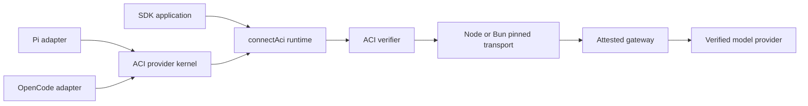

# ACI client architecture

This page is for maintainers building a new client or host adapter. It defines
the product boundary, component ownership, and the security contract every
supported integration must preserve.

## Design goal

An ACI client verifies the remote confidential workload before sending model
request bytes. That capability belongs in a shared transport and verifier, not
inside Pi, OpenCode, or any one SDK integration.

Normal HTTPS authenticates a domain. The ACI client additionally checks which
TEE workload is behind that domain, which keys it owns, which compose was
measured at launch, and whether the connection carrying plaintext is bound to
an attested key.

## Layers

```mermaid
flowchart LR
  app[SDK application] --> runtime[connectAci runtime]
  pi[Pi adapter] --> provider[ACI provider kernel]
  oc[OpenCode adapter] --> provider
  provider --> runtime
  runtime --> verifier[ACI verifier]
  verifier --> transport[Node or Bun pinned transport]
  transport --> gateway[Attested gateway]
  gateway --> upstream[Verified model provider]
```

| Layer | Responsibility | Must not own |
| --- | --- | --- |
| `@phala/aci-verifier` | Quote, nonce, keyset, measurement, expiry, channel, wire-digest, receipt, and session verification | Host auth UI, model persistence, or provider branding |
| `connectAci()` runtime | One origin-scoped verified connection and fetch implementation | Global TLS state or cross-origin pins |
| `@phala/aci-provider` | Connection lifecycle, catalog validation, TEE filtering, capabilities, receipt history, response verification, and structured inspection | Host credential storage or host-specific UI |
| Pi adapter | Pi Provider/Auth APIs, settings, commands, footer state, and native persistence | Independent verification or credential storage |
| OpenCode adapter | Server-plugin config, auth loader, models, commands, tools, and disposal | Independent verification or credential storage |
| Branded package | Provider ID, label, endpoint, environment names, and optional account flow | A fork of the shared trust logic |

Applications that accept a custom `fetch` can use `connectAci()` directly.
Applications with a provider lifecycle should use the provider kernel. A base
URL alone cannot install an attested TLS transport, so a host that exposes
neither boundary needs a local verified proxy such as `pap serve`. Changing only
its base URL is not an ACI integration.

## Shared trust contract

Every supported runtime path must:

1. Fetch a fresh nonce-bound report before model traffic.
2. Verify the hardware quote and the keyset digest bound into `report_data`.
3. Verify `sha256(app_compose)` against the RTMR3 `compose-hash` event.
4. Apply any configured accepted-compose policy.
5. Reject expired keysets.
6. Validate the destination hostname and require its observed TLS SPKI to
   appear in the attested keyset.
7. Apply `aci_verified` and accepted-session constraints unless the caller
   explicitly opts out of verified provider serving.
8. Capture the exact request and response wire digests needed for receipt
   verification.
9. Verify the signed receipt and cited session before completing a response
   when the host promises automatic response verification.
10. Fail closed on every required check, including cancellation races.

The Rust and TypeScript transports differ in these details:

- The TypeScript verifier reports the quote's TCB status without enforcing it.
- When the keyset scopes TLS keys to domains, the Rust CLI accepts only the
  entry the report declares in `downstream_tls_binding`. The TypeScript runtime
  accepts any attested key for the host.
- `pap send`, `pap serve`, and the TypeScript runtime require verified serving
  by default; the TypeScript runtime applies this to JSON POST requests.
  `pap curl` sends the caller's body unchanged, so the request must carry
  `provider.aci_verified` or session IDs to fail closed at the provider hop.
- Browser APIs do not expose the peer certificate, so the browser verifier can
  check artifacts and quotes but cannot pin a channel. Use the Node or Bun
  runtime, the Rust CLI, or `pap serve` for a pinned channel.

## Response verification

Clients differ in when they verify a response receipt:

| Client | Default | Behavior |
| --- | --- | --- |
| `pap send` | Always | Verifies the receipt and cited session for its one exchange. |
| `pap curl` | Never | Pins the channel only; it does not verify a response receipt. |
| `connectAci()` | On demand | Requires an `X-Receipt-Id` on every successful POST and records the exchange. The caller runs `verifyReceipt()` when it wants the audit, so inference latency excludes the receipt fetch. |
| `@phala/aci-provider` | On demand | `receipts.verification` defaults to `"on-demand"`. Set it to `"response"` to hold stream completion until the receipt and session verify. |
| Pi and OpenCode adapters | Response | Set `receipts.verification` to `"response"`. A failed audit ends the model stream before the host can continue its tool loop. |

The runtime, provider, Pi, and OpenCode keep the latest 32 receipt-bearing
exchanges in process memory by default. A receipt can receive a complete audit
only while its exchange is retained.

## Provider contracts

The provider kernel exposes four host-neutral contracts:

| Contract | Shared provider owns | Host adapter owns |
| --- | --- | --- |
| Lifecycle | Resolve policy, establish the verified connection, expose scoped fetch, and close it | Create and dispose the provider through native hooks |
| Model catalog | Validate `/v1/models`, filter, and map declared capabilities, prices, limits, and modalities | Convert `AciModel` into the host model type and persist selection |
| Account authorization | Describe a browser or device flow and return one API key plus optional metadata | Present the flow and persist the resulting credential |
| Inspection | Return structured status, attestation, receipt, and session results | Register native commands or tools and render the result |

A new adapter maps these contracts into official host APIs. It must not
reimplement attestation, device polling, receipt semantics, model inference, or
credential persistence.

## Catalog authority

The gateway catalog is the only source of model capabilities:

- `supported_features` controls reasoning and tool support;
- `supported_sampling_parameters` controls temperature support;
- an empty capability array turns the capability off;
- required limits, modalities, prices, and capability arrays must validate;
- missing optional cache prices stay absent, except in Pi, whose model type
  requires every rate and so bills an omitted cache rate at the input rate; and
- clients do not infer a model family or request dialect from the model ID.

Provider-specific reasoning dialects remain a gateway routing concern. Clients
use the gateway's normalized public reasoning fields.

## Runtime isolation

`connectAci()` is instance-scoped. Multiple providers can coexist without
sharing pins, connection state, credentials, model catalogs, or receipt
history.

Node uses an undici dispatcher scoped to the connection. Bun uses its native
TLS and proxy fetch options. Conditional package exports select the adapter;
all verification and policy logic above the TLS hook is shared.

Pi owns credentials, dynamic-catalog persistence, default-model persistence,
and provider lifecycle through its native APIs. OpenCode owns plugin
configuration and credential persistence. Neither adapter maintains a parallel
host state store.

## Release acceptance

Hardware proof does not identify an approved product release by itself. What a
passing check proves, and how to choose accepted releases, is described in
[Build a verifier policy](../docs/attested-confidential-inference.md#build-a-verifier-policy).
Clients run in one of two modes:

- In **hardware-bound mode**, the client proves a genuine TDX workload owns
  the attested keys and reports its measured compose.
- In **reviewed-release mode**, the client also requires that compose hash to
  appear in a reviewed allowlist.

Rust takes reviewed hashes through repeatable `--accept-compose` flags.
TypeScript calls the same policy `acceptedComposeHashes`, and conformance tests
keep the two aligned. The provider kernel reads it from
`trust.acceptedComposeHashes` or from the comma-separated
`<PREFIX>_ACCEPTED_COMPOSE_HASHES` environment variable, such as
`REDPILL_ACCEPTED_COMPOSE_HASHES` or `PHALA_ACCEPTED_COMPOSE_HASHES`.

The report's `source_provenance` repository and commit are the gateway's own
statement. The compose hash is the RTMR3-bound release anchor. Load reviewed
hashes from authenticated release metadata; never copy a hash from the endpoint
and trust it on first use.

The branded Pi and OpenCode packages ship no accepted compose hashes, so they
run in hardware-bound mode unless the user supplies hashes. Their attestation
command then reports `measurement verified, release not pinned`.

Shipping reviewed hashes in the branded packages is planned. It needs these
steps:

1. Review the source and complete deployment compose.
2. Produce the deterministic compose hash.
3. Publish it through an authenticated release channel.
4. Ship it in the branded client policy.
5. Exercise accepted and rejected measurements in Rust and TypeScript.

The release channel must allow a controlled overlap during rotation.
Publishing the npm packages does not by itself establish a reviewed-release
claim.

Key custody is also a review decision. The Rust CLI can check the
receipt-signing key's KMS chain; the TypeScript verifier does not check
custody. See
[The privacy claim](../docs/attested-confidential-inference.md#the-privacy-claim).

## Trust boundary

The local application or coding agent sees plaintext prompts and responses.
These clients protect the remote model HTTP path. MCP servers, tools, browser
automation, shell commands, WebSockets, extensions, and host telemetry require
their own threat models.

Provider authentication is also outside ACI. RedPill packages accept API keys.
Phala Cloud packages add the shared device authorization flow. Pi and OpenCode
persist credentials through their own native stores; the ACI packages do not
create a parallel credential database.
